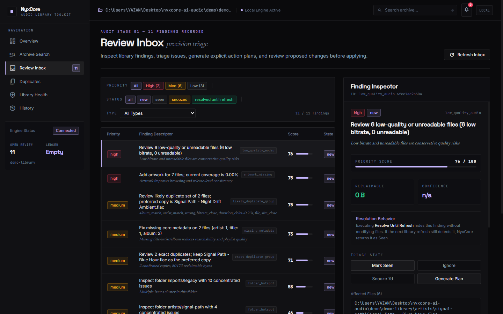
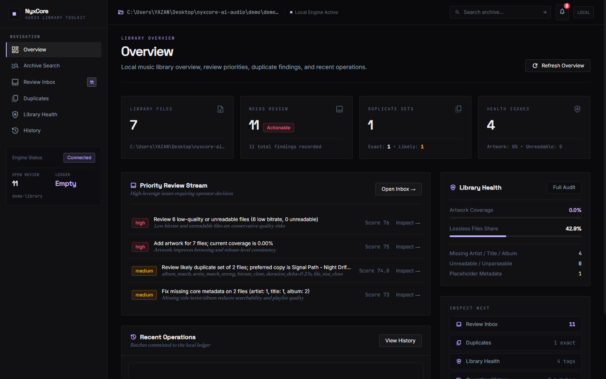
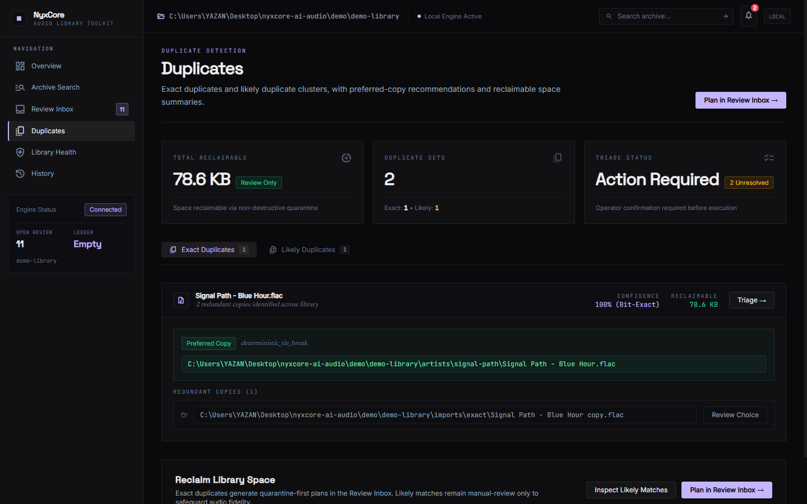
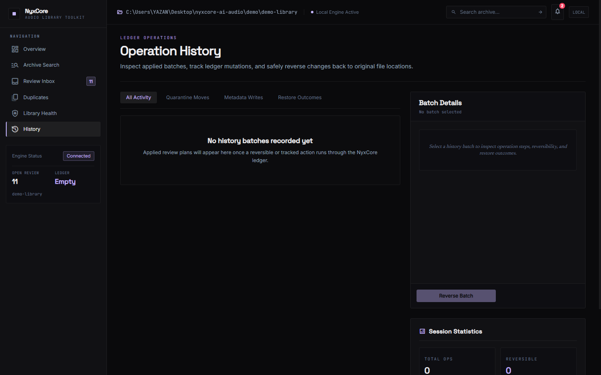
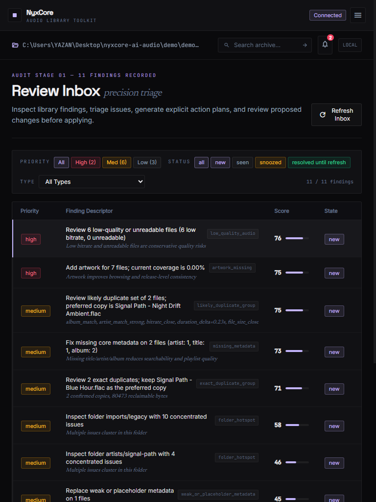

# NyxCore

> NyxCore is an experimental local-first music-library review toolkit for people who manage folders of audio files rather than streaming playlists.

NyxCore scans a local audio directory, surfaces duplicate and metadata health findings, builds an interactive review queue, generates explicit, inspectable action plans, and applies selected operations with journaling, single-writer locking, quarantine-based moves, and reversible history.

Everything runs against local files and local state. NyxCore does not require cloud accounts, remote media servers, or hosted databases.

Current release version: `0.3.0`


*NyxCore Review Inbox: inspect finding details, review generated plan operations, and selectively approve changes before execution.*

---

## Core Workflow

NyxCore enforces a strict review-first lifecycle:

```
scan
  → detect duplicate / health findings
  → review
  → generate explicit action plan
  → safely apply selected operations
  → inspect history
  → reverse when supported
```

1. **Scan**: Indexes audio files (`.mp3`, `.flac`, `.ogg`, `.m4a`, `.wav`, `.aif`, `.opus`), reading metadata tags and file characteristics using pure Python (`mutagen`).
2. **Detect Findings**: Runs duplicate analysis (exact SHA-256 and likely fuzzy metadata/duration matches) and library health checks (missing tags, placeholder values, low bitrates, missing artwork).
3. **Review**: Aggregates findings into a unified, prioritizeable review queue. Findings can be triaged without altering audio files.
4. **Plan**: Compiles approved review items into a serialized JSON action plan with explicit source paths, destination paths, field modifications, and cryptographic content fingerprints.
5. **Apply**: Executes selected plan operations under a library-scoped single-writer lock with durable intent journaling. Duplicate files are relocated to `.nyxcore_quarantine` rather than deleted.
6. **Inspect History**: Every applied batch is recorded in a local history ledger with execution timestamps, per-operation statuses, and rollback fingerprints.
7. **Reverse**: Supported operations (such as metadata updates and quarantine moves) can be undone or restored after verifying that files have not been modified externally.

---

## Approved Public Surfaces

The web interface exposes six approved public views:

| Route | Surface | Purpose |
|---|---|---|
| `/` | **Overview** | Library summary metrics, finding category distributions, recent activity, and quick access. |
| `/search` | **Archive Search** | Unicode-normalized, read-only search across filenames, tags, genres, and directory paths. |
| `/review` | **Review Inbox** | Central triage and plan execution workbench with expandable finding cards and plan previews. |
| `/duplicates` | **Duplicates** | Dedicated exact and likely duplicate clusters with track comparisons and review links. |
| `/health` | **Library Health** | Detailed integrity diagnostics: missing metadata, placeholder tags, artwork gaps, low bitrates. |
| `/history` | **History** | Chronological audit log of applied operation batches with reversal inspection and undo actions. |

> **Scope Note**: A saved-playlists query backend exists in the codebase for experimental research, but its web UI route (`/playlists`) is deferred and intentionally unexposed in this release.

---

## Safety Architecture & Limitations

NyxCore is designed around defensive, local-first safety primitives:

- **Explicit User Review**: No autonomous or background mutations. Every file modification or relocation requires an explicit action plan generated from human review.
- **Serialized Action Plans**: Plans are written to `review_plan.json` with strict operation schemas, preflight validation, and content fingerprints. Plans exceeding 50 operations are flagged for mandatory manual review.
- **No-Clobber Quarantine**: Duplicate removals never delete files directly. Non-preferred copies are moved into `.nyxcore_quarantine/` with collision-safe naming. Normal scans ignore quarantine folders.
- **Durable Intent Journaling**: Before modifying audio files, operations are journaled to disk. If an apply operation is interrupted, the journal records exact progress for recovery.
- **Single-Writer Locking**: A library-scoped lock file (`.nyxcore_lock`) prevents multiple processes or tabs from executing concurrent mutations on the same music directory.
- **Crash Recovery Inspection**: The CLI command `recover-review-action --action inspect` classifies interrupted operations into provably safe states before offering `finalize` or `abort`.
- **Pre-Rollback Fingerprint Verification**: Reversal checks current file SHA-256 fingerprints before moving or restoring files. If external changes have occurred since the batch was applied, the rollback halts to prevent overwriting user edits.
- **Metadata Backups**: Pre-edit metadata states are preserved in `.nyxcore_backups/` before in-place tag updates.

### Important Limitations

> [!WARNING]
> **No ACID Guarantees**: NyxCore operates directly on local filesystems. It does not provide distributed transactions, two-phase commits, or atomic directory swapping.
>
> **No Infallible Rollback**: Rollback depends on file availability and unchanged fingerprints. If files are moved, locked by media players, or edited by other programs outside NyxCore, reversal cannot guarantee restoration.
>
> **Experimental Status**: Always test on a copy or use the synthetic demo library before running actions against your primary music archive.

---

## Screenshot Showcase

### Overview

*Overview dashboard displaying library scan status, finding counts, and direct navigation.*

### Duplicates Analysis

*Duplicates view showing exact SHA-256 and likely duplicate groups with comparison metrics.*

### Library Health

*Health diagnostic report detailing missing tags, placeholder titles, artwork coverage, and bitrate distribution.*

### Operation History & Reversal

*Audit history displaying executed batches, affected paths, and reversible action controls.*

### Plan Execution Report Modal

*Execution summary modal detailing succeeded, failed, or skipped operations following a plan application.*

### Tablet & Responsive Support

*Responsive layout verified across tablet and mobile viewports with accessible focus styling.*

*For the complete gallery of release screenshots and responsive verification captures, see [`screenshots/README.md`](screenshots/README.md).*

---

## Requirements

- **Python**: `3.11+`
- **Node.js**: `18+` and `npm` (for the web frontend)
- **Audio Metadata Support**: Pure Python via `mutagen` (`.mp3`, `.flac`, `.ogg`, `.m4a`, `.wav`, `.aif`, `.opus`). No external media binaries are required for core indexing, health reporting, duplicate matching, or action plans.
- **Optional External Tools**:
  - `ffmpeg`: **Only** required if you want to generate synthetic audio test files with `demo/create_demo_library.py` or run optional CLAP audio transcoding. It is not required for the core scanner or web application.

---

## Quickstart Guide

### 1. Set Up Python Environment

```bash
# Clone the repository
git clone https://github.com/DRGYZ/nyxcore-ai-audio.git
cd nyxcore-ai-audio

# Create and activate a virtual environment
python -m venv .venv

# Linux / macOS:
source .venv/bin/activate

# Windows (PowerShell):
# .venv\Scripts\Activate.ps1

# Install core package with web API dependencies
python -m pip install --upgrade pip
pip install -e ".[web]"
```

### 2. Generate Demo Fixture (or Use Your Own Music Folder)

To test NyxCore safely without touching real audio files, generate the included synthetic demo library (requires `ffmpeg`):

```bash
python demo/create_demo_library.py --force
```

This creates a self-contained sample library under `demo/generated/sample-library/` containing intentional duplicate pairs, missing tag cases, placeholder names, and bitrate variants.

### 3. Generate Reports via CLI

```bash
# Run duplicate detection
python -m nyxcore.cli duplicates demo/generated/sample-library --out data/reports

# Run health diagnostics
python -m nyxcore.cli health demo/generated/sample-library --out data/reports

# Generate unified review queue
python -m nyxcore.cli review demo/generated/sample-library --out data/reports
```

### 4. Launch the Web API

Configure the music and report output roots via environment variables:

```bash
# Linux / macOS (bash/zsh)
export NYXCORE_WEB_MUSIC_DIR="$(pwd)/demo/generated/sample-library"
export NYXCORE_WEB_OUT_DIR="$(pwd)/data/reports"
uvicorn nyxcore.webapi.app:app --reload --port 8000
```

```powershell
# Windows PowerShell
$env:NYXCORE_WEB_MUSIC_DIR = (Resolve-Path "demo/generated/sample-library").Path
$env:NYXCORE_WEB_OUT_DIR = (Resolve-Path "data/reports").Path
uvicorn nyxcore.webapi.app:app --reload --port 8000
```

The API will be available at `http://127.0.0.1:8000` (`http://127.0.0.1:8000/docs` for interactive OpenAPI docs).

### 5. Launch the React Web UI

In a separate terminal:

```bash
cd web
npm install
npm run dev
```

Open `http://127.0.0.1:5173` in your browser. The UI connects to `http://127.0.0.1:8000/api` by default and indicates `LIVE API` mode in the header badge.

---

## CLI Reference

NyxCore provides a unified CLI under `python -m nyxcore.cli`:

### Core Inspection & Review Commands

```bash
# Index library and output scan summary
python -m nyxcore.cli scan <music-dir> --out data/reports

# Detect exact and likely duplicates
python -m nyxcore.cli duplicates <music-dir> --out data/reports

# Run metadata, quality, and artwork health checks
python -m nyxcore.cli health <music-dir> --out data/reports

# Build review queue
python -m nyxcore.cli review <music-dir> --out data/reports

# Generate action plan for a specific review item
python -m nyxcore.cli review-plan <music-dir> --out data/reports --item-id <item-id>

# Apply a validated action plan
python -m nyxcore.cli apply-review-plan data/reports/review_plan.json --music <music-dir> --out data/reports

# View operation history
python -m nyxcore.cli history --out data/reports

# Reverse an executed batch
python -m nyxcore.cli restore-review-action --batch-id <batch-id> --out data/reports

# Inspect or recover interrupted operations
python -m nyxcore.cli recover-review-action --action inspect --out data/reports
```

### Note on Legacy / Experimental Mutation Commands

Earlier experimental CLI verbs (`apply`, `rename --apply`, `rename-undo`, `apply-ai`, `apply-judge`) are intentionally **disabled** in this release. All supported mutations must flow through the inspected `review` → `review-plan` → `apply-review-plan` pipeline to ensure locking, journaling, and verification.

---

## Repository Structure

```
nyxcore-ai-audio/
├── .github/workflows/       # CI test automation
├── demo/                    # Synthetic audio fixture generator & docs
├── docs/assets/screenshots/ # Screenshot documentation pointer
├── nyxcore/                 # Python backend package
│   ├── core/                # Scanner, track model, hashing, locking
│   ├── duplicates/          # Exact SHA-256 and fuzzy tag/duration matcher
│   ├── health/              # Missing metadata, artwork, bitrate checkers
│   ├── review_queue/        # Review item generation and triage state
│   ├── action_plan/         # Action plan generator, validator, journal, executor
│   ├── search/              # Read-only Unicode-normalized archive search
│   └── webapi/              # FastAPI REST endpoints
├── screenshots/             # Release screenshots and responsive verifications
├── tests/                   # Backend pytest test suite (142 tests)
└── web/                     # React 18 + TypeScript + Vite frontend
    ├── src/                 # Components, pages, hooks, state
    └── tests/               # Frontend Vitest test suite
```

---

## Testing & Validation

Run backend tests:

```bash
pytest
```

Run frontend test suite:

```bash
cd web
npm test
```

Run frontend production build:

```bash
cd web
npm run build
```

---

## WSL2 Setup

For running NyxCore inside Windows Subsystem for Linux (WSL2), refer to the dedicated [WSL2 Setup Guide](INSTALL_WSL.md).

---

## License

No open-source license has been declared for this repository yet. All rights reserved.
